Battleships Game

This is a program to run a "Battleships" logic game in a mock terminal.

# User Stories
As a user I want the computer to be able to make intelligent choices, meaning that its coordinates 
for attacking are random up until it hits a ship, and it then tries to find the rest of the ship.

I want to be able to place my own ships both manually and automatically.

# Features
1. Automatically scale the number of ships for players based on board size.
2. Allowing the player to place ships manually and automatically.
- -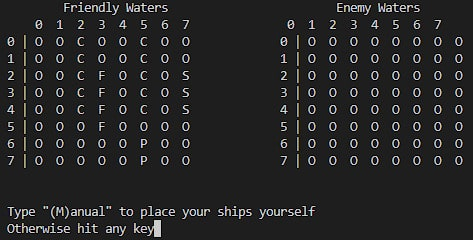
- In this example the ships have been manipulated into columns, starting from the top of the board. 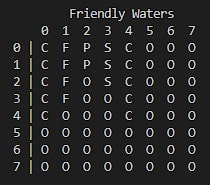

3. Turn counter to limit player moves and enforce end condition.
- Guesses clock down in example from 43 to 42.
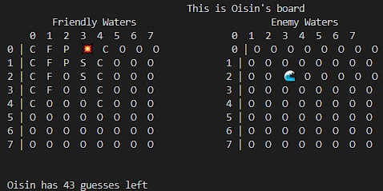 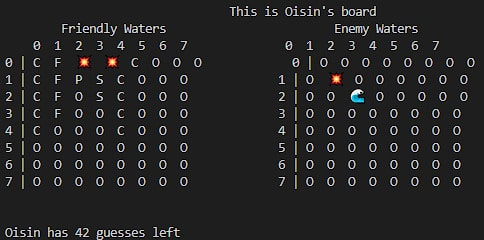

4. Feedback for invalid inputs and guesses.
- Here the user has a raise statement if the guesses is beyond the parameters of the board, or if the location was already guessed.
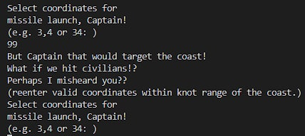 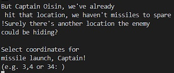

5. Allow the player to set the board size.
- Currently the game allows inputs of either 8 or 10 for square playing board. Though the code has been written otherwise to attempt to be adjustable. Namely this is relevant to the guess limit counter and amount of ships in play.
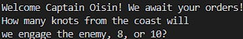  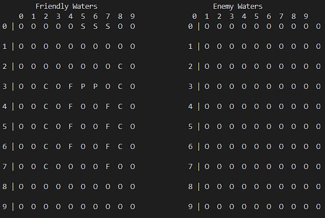

6. Intelligent targeting by computer.

- To show the trackers behaviour, below is a full turn by turn documentation of what happens where the computer finds a valid target.

- The computer's random choice eventually finds a valid target.
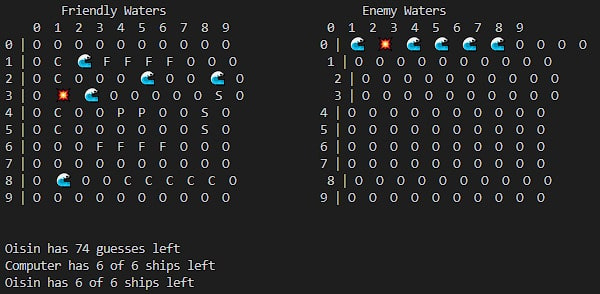
- The computer, on its next move, should randomly choose between right, left, up, or down, for its next hit, attempting to seek out the rest of the hit ship. In this case it's 25% chance is successful, and it locates a second part of the ship.
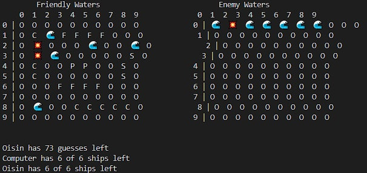
- On the third move it follows this direction for as long as it continues to find valid hits.
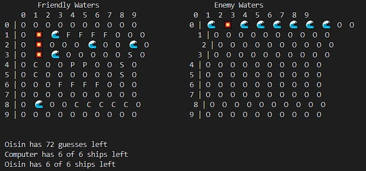
- On the forth move it hits empty ocean. It should from here, recalibrate its behaviour.
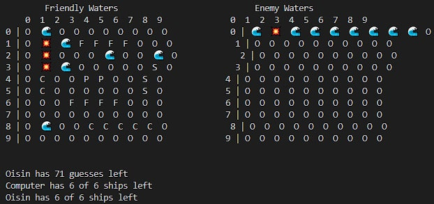
- Presumably, if the spot above the wave hit on the last turn was a valid option, not out of bounds, the computer would not select it. It now is repeating the random selection between right, left, up, and down. But since three of four options are able to return that they are already guessed, it chooses the remaining option, despite the random protocol.
However, this is a flaw. The computer should be sent back to its original hit on this ship, not seek around the last spot, but simply continue down the same direction on the othe end.
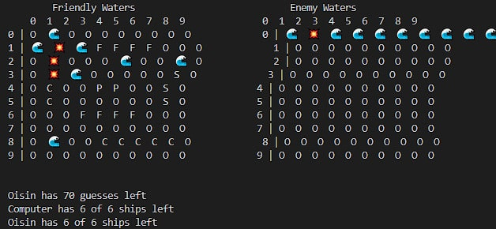
- On the next move, we return to the original hit, the computer has made a hit below the original. Presumably, it had a 50% chance of selecting 3,0 as coordinates.
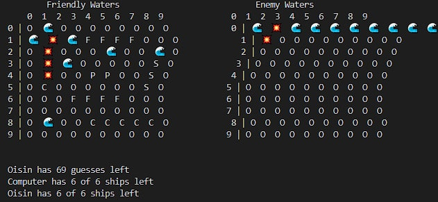
- The computer follows earlier behaviour and continues on, in this case, not until an unsuccessful hit, but until the ship returns that it is sunk. At the bottom of the image, the player's remaining ships out of total ships is adjusted.
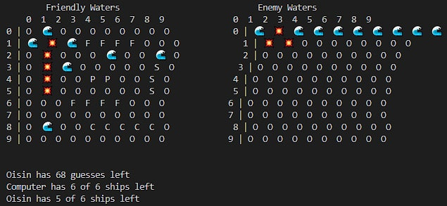
- Here on the next turn, the emojis have changed to reflect the sunken ship.
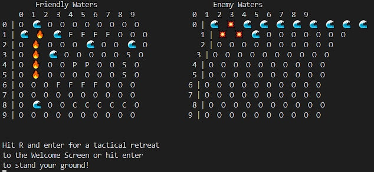
- Finally, the computer returns to random guessing, at co-ordinates 6,8.
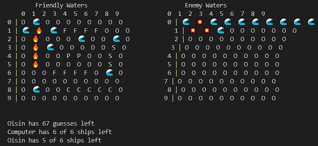

# Build Log

## Initialising Repository Setup
- Python essentials template added.
- Python files for each class created and defined.
- Nesting order between classes established in doc string.
- README file intiated with user stories, features to be included, Build Log, Error, Testing, and Deployment headers. Deployment content completed.

## Logic Flowchart
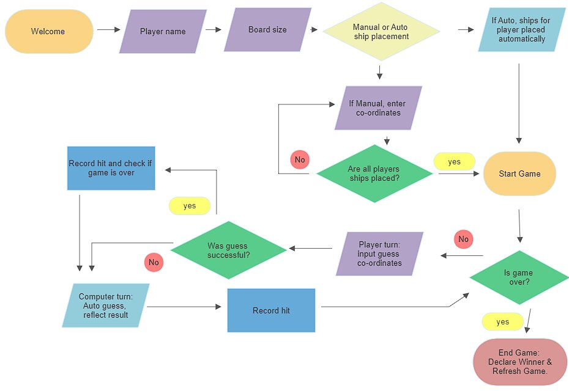

## Plan of Action
- Create a minimal viable product version first. Use one ship, random only not manual placement of ships, maybe without error handling yet, or win conditions. Test deployment on Heroku.
        1. Establish ship class
        2. Give one ship subclass its objects
        3. Define what is a board and pass through the ship subclass
        4. Define the players and pass through the board
        5. Define the game structure and pass through player
        6. Initate game function through run.py file.

## Ship
- Create a ship class and add docstring explaining its objects.

## Ship Subclasses
- Create only the 'Carrier' class for now, with explaination of its objects.

## Boards
- A lot of work done on Boards. So far it does three things:
    - Create an instance of a board for player and computer
    - Print this to the terminal for user to see
    - Define boards by handling them as coordinates inside arrays
    All this is done within a scalable frame, allowing for user input of board size.
- Remembered to import random module for use in Boards class.
- Player instance initialisation created, and the make guess function which currently gives the computer only a random choice, takes in the players input as
coordinates, and validates both as already guessed.
- Created a build ship def that holds a placement_process while True loop.
The loop uses ship start coordinates, ship length, and ship direction to automatically log the remaining ship coordinates. It checks these against existing
ship coordinates and against 'going off the map'. Until its list of coords do not
match the existing coords, then it will repeat the function to randomly select the
starting coords.
- Created a dictionary of 'fleet' coords to match against guesses.
- Created a function to check guess against 'fleet'.
- Created a function to reduce number of ships a board has by one.
- Created a function to trigger sink ship function, where damaged tiles = ship length.

## Game
- Started coding game.py file. Given class of game and welcome screen ASCII art. 'Options menu' offers input of hit enter, once any input entered, option_menu False and create players will be called.
- Outline the functions needed in the file, and their behaviour.
- Game class has function to create instances of players, user and computer. Afterwhich it calls a play_game function.
- The Play Game function will:
 1. Create a loop while game over condition is false
 2. Establish what happens when game over is true
 3. Allow player to exit game before game ending conditions are met
 4. Trigger ending where all ships are sunking, differentiating between
 computer or player victory.
 5. Give feedback noting result.
- Create function to display both boards.
- Create function to restart game.

## Utilities
- Outline functions help in utilities class to be called on throughout other classes.
- Added all functions for utilities with validation methods.
 1. Name input
 2. Size of board input
 3. Duplicate checks
 4. Coordinates validator
 5. Error message
 6. Clear display

 ## Run
 - import Game and call on its function

# Testing
- Deploying to Heroku from commit number 46.
        Error: Build failed.
        Methods: Trying to fix by adding requirements.txt.
        Result: Build successful in Heroku, even though .txt was empty.

        Error: Terminal could not get past line 6 of run.py.
        Methods: Call on class of game through its parent folder e.g. from classes.game.
        Result: Progression to next error.

        Error: In player.py class of Board was called from file with incorrect spelling.
        Methods: Changed boards to board for correct identification of file.
        Result: Continuation to next error, still regarding calling of files and modules.
        
        Error: Utilities not recognised in code
        Methods: Matching call of utilities to how its called into file as classes.utilities.
        Results: Progress to next error log from Heroku.

        Error: In input of name, utilities class function, call of string not defined.
        Methods: Importing string module to utilities class.
        Result: Fixed error, game progressing.

        Error: Any input of board size returns same input prompt.
        Methods: No return given at end of loop, so loop looped.
        Results: Fixed error, progress to next.

        Error: The amount of ships is to be determined by board size. However this is written as size divided by 2 + 1. I can't divide a str by an int.
        Methods: Trying wrapping size in brackets. Failed.
                - Wrapping (size)/2 in brackets from + 1, to enforce BOMDAS
                - Giving expression // instead of / for rounding function just discovered.
                Failed
                - Readdress the problem through code in board.py lines 46-54
                Failed
                - Hardcoding amount of ships for now to progress. Can return later.
        Results:

        Error: "build_board takes 1 argument but 2 were given"
        Methods: Advised to try 'staticmethod' on function.
        Results: Progressed to next error.

        Error: # symbol used for board building, error reports requires int.
        Methods: Subbed in 0. Failed.
                - (size) needed to be declared as an int after the return
                function of the validator loop in the utilities class.
        Results: Progresses to next error.

        Error: The ship subclasses are now create their own instances with init function. They are identified per instances instead of their type and symbol.
        Local terminal "attempted relative import with no know parent package"
        Heroku terminal "missing 1 positional arguement: 'identifier'.
        Methods: I'm going to give the parent class the identifier object.
                - Removed line break that for the pep8 standards to see if it was breaking the code. Failed and restructured for pep8.
                - Added i as int in list of arguments.
        Results: New error.

        Error: Line 72 of player too long for pep8. Can't figure how to break line without breaking code.
        Methods: Running through pep8 lint for solution.
                - changed def to a shorter name.
        Results: pep 8 standards upheld.

        Error: Game breaking when a guess is made outside of the board.
        Methods: Created raise statement for guesses outside of board limitations
        Results: Game won't break, player is invited to guess again.

        Error: Heroku unable to play sounds, asks to install pygobjet
        Terminal in gitpod doesn't recognise 'pip install pygobject' command.
        Methods: White out code relating to sound with #.
        Results: Currently continuing without sound.

        Error: Tile validation error, ships are being placed over one another.
        Methods: Function "try to return to beginning of hit seq" defaulted to its else condition of select random. Adjusted code, and called on properly from get guess function.
        Result: Intelligent tracking operational.

        Error: Tracker for intelligent computer choices not working
        Methods: Arguments in tracker missing

        Error: Game end conditions aren't triggering.
        Method: Running out of turns did trigger end. Resolving error below, where ship sunk wasn't working by continuing to use the identifier attribute throughout code.
        Result: Game end conditions are in effect.

        Error: Ship count is not reduced once full ship is successfully destroyed.
        Methods: Guess checker function looked for change from 0 integer on board, updated to use ship.identifier.
        Results: Full ship targeted means new emoji, and ships left tracker counts down.

        Error: When auto placing ships, if a ship over laps another, the code randomises the segments position but not the whole ship, leaving parts of the same ship scattered across the board.

# Validation
Ran code from all files through PEP8 linter
1. Board
-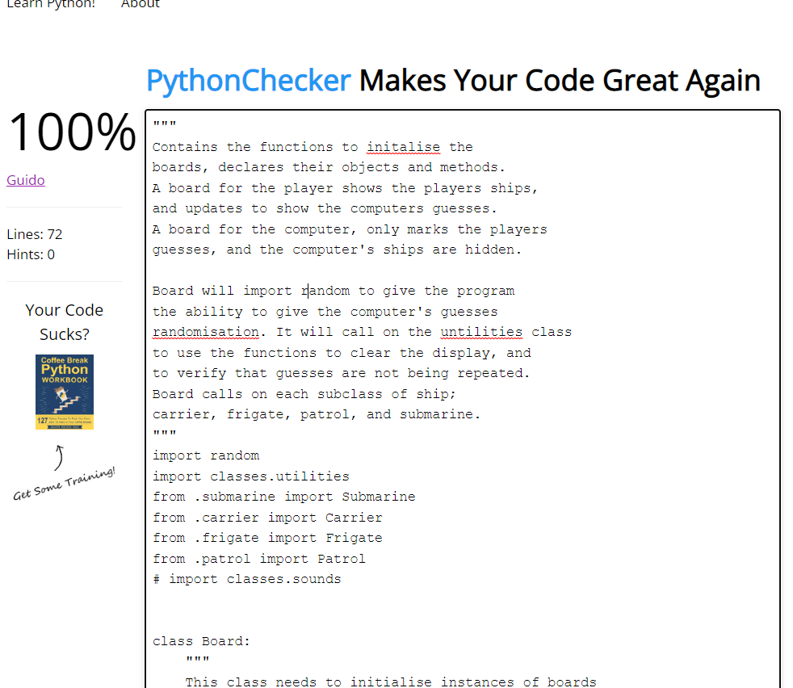
2. Carrier
-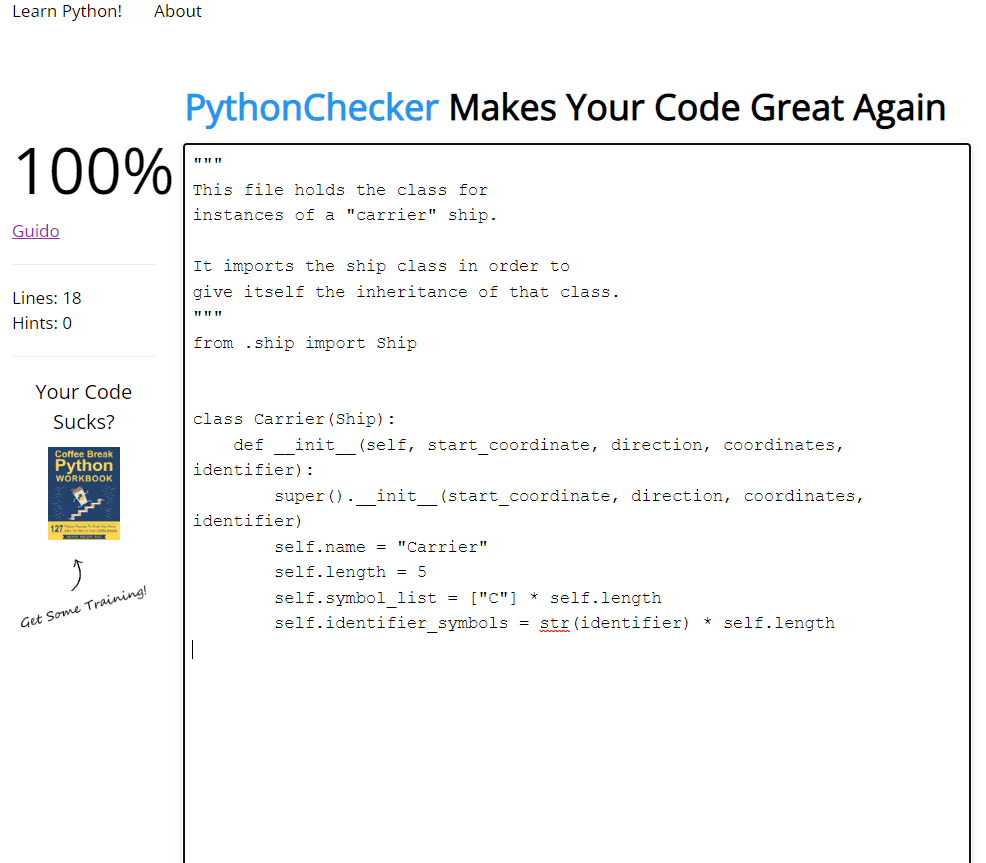
3. Frigate
-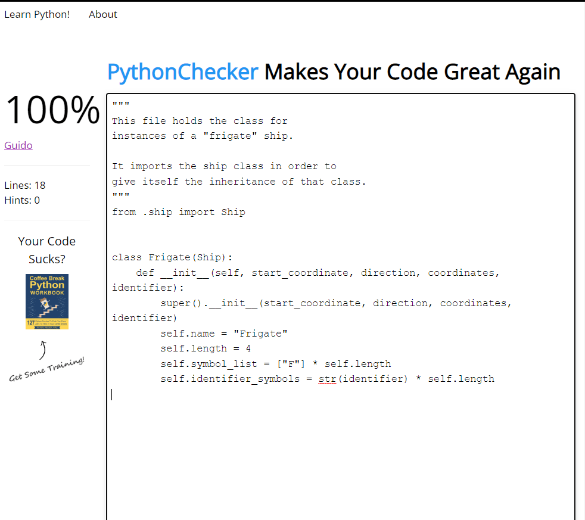
4. Game
-
5. Patrol
-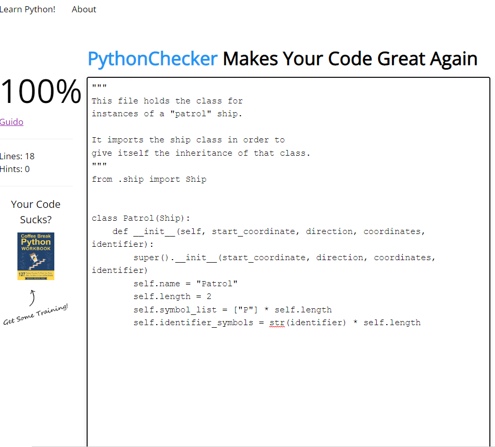
6. Player
-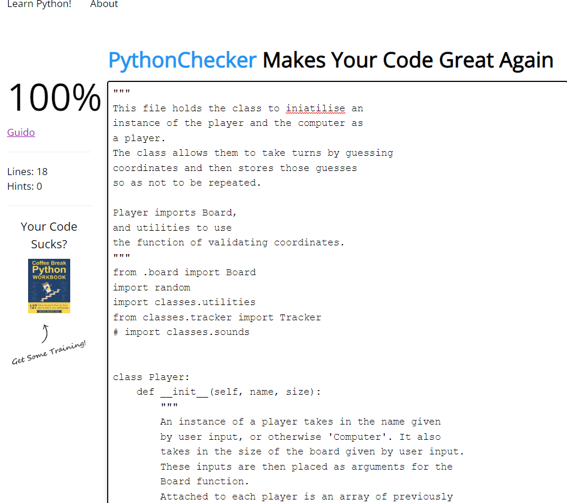
7. Run
-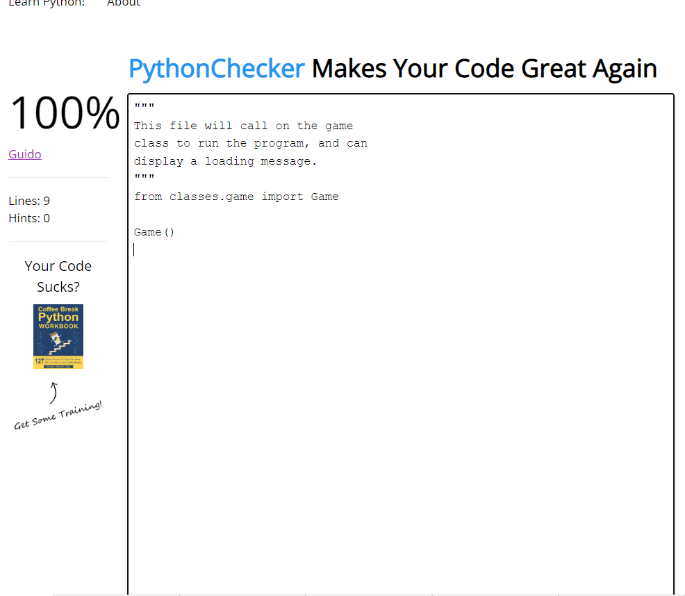
8. Ship
-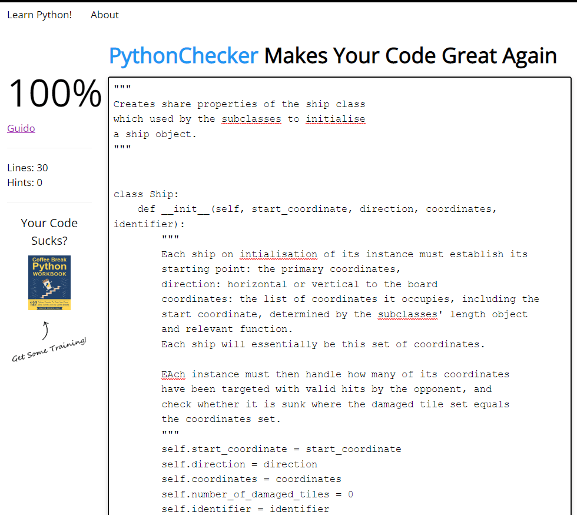
9. Sound
- Note linter complained about hyphenation in sound file naming,
misunderstanding them as minuses and requesting spaces around them.
*Linting performed to PYCODESYLE requirements.*

-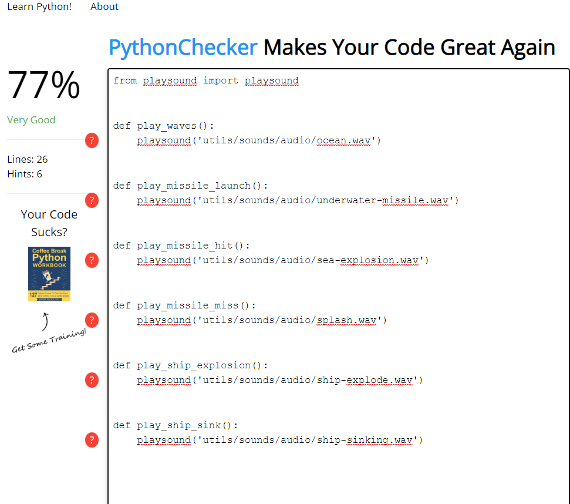
10. Submarine
-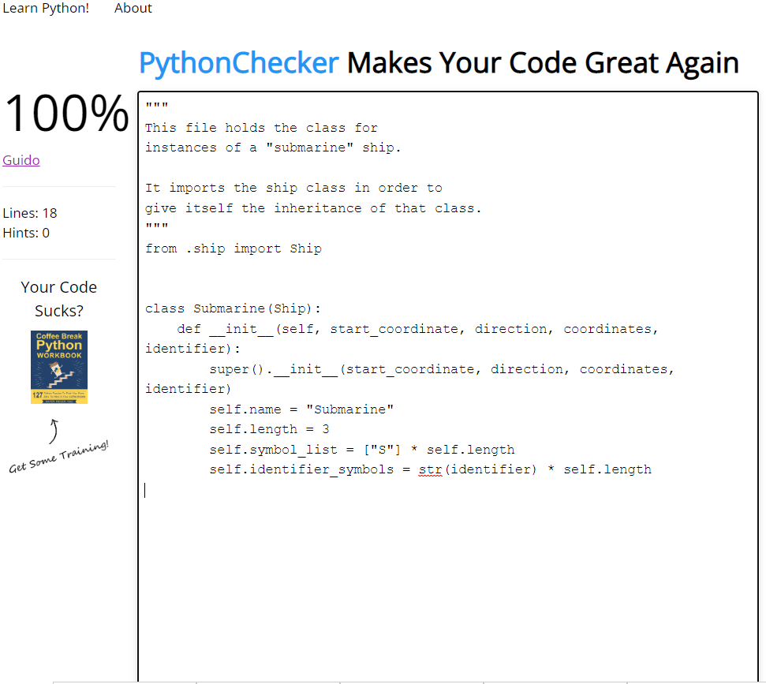
11. Tracker
-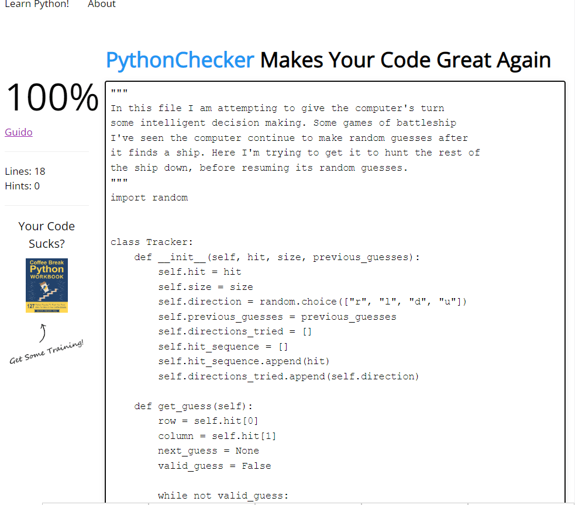
12. Utilities
-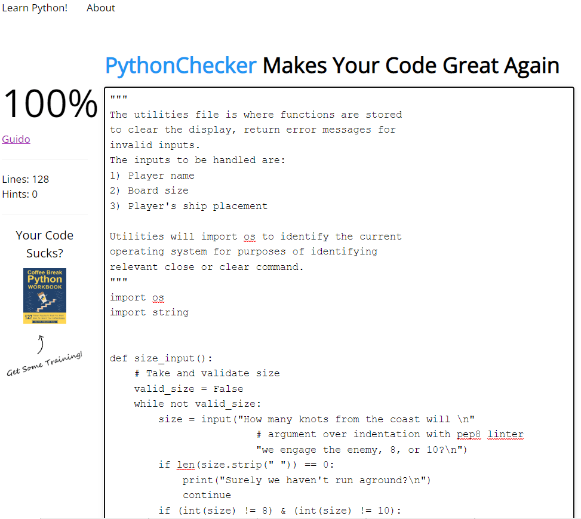

# Citation
Information from Stack Overflow: https://stackoverflow.com/questions/36695039/python-battleships-game
Inspiration from an example build on youtube: https://www.bing.com/videos/search?q=write+a+battleships+game+using+python+youtube&view=detail&mid=8594DB5588419EE0334C8594DB5588419EE0334C&FORM=VIRE
For images and fonts in terminal: http://patorjk.com/software/taag/#p=display&f=X99&t=Type%20Something%20

# Deployment
    ## Deploying to Heroku
    1 Create an account with Heroku, and navigate to the main page by clicking on "Heroku" at top left of screen.
    2 Click the "New" button in the upper right of screen, select "create new app" from the drop-down menu.
    3 Type an app name in the prompted text field, ensuring the chosen name is available.
    4 Select the appropriate region, between "America" and "Europe".
    5 Click the button below "Create App"
    6 Navigate to settings from the upper menu bar.
    7 In the second section of settings, "Config Vars", click "Reveal Config Vars".
    8 Add a config var with KEY=PORT, and VALUE=8000.
    9 In the next section, add two buildpacks, one for python and one for nodejs, in that order.
    10 Navigate to the "Deploy" section where you found the "Settings" tab.
    11 In the second section, "deployment method", connect to your GitHub account.
    12 Once you've allowed GitHub to connect with Heroku, a new subsection should appear with a search bar for a repository connected to the relevant GitHub account.
    13 Hit the "Search" button and select the "Connect" button beside the relevant repository.
    14 Now you can choose a branch to deploy from or leave as default "main".
    15 Click the "Enable Auotmatic Deploys" button.
    16 You can monitor the build progress through the "Overview" tab.
    17 Clicking "Open app" in the upper right of screen with attempt to run the program in a new window.